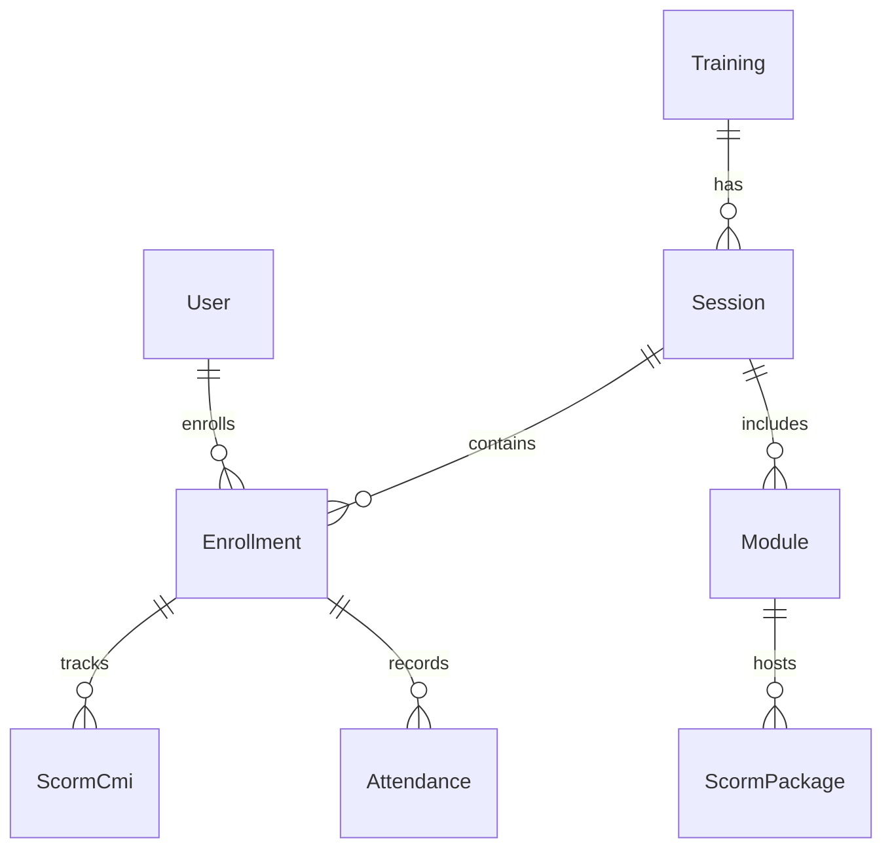
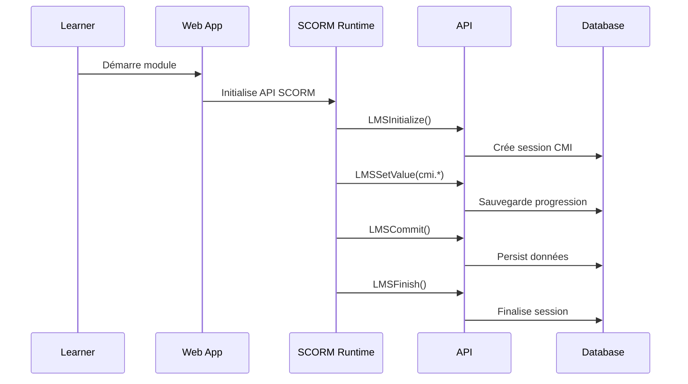

# Architecture technique CIPFARO E-learning

## 🏗️ Vue d'ensemble

La plateforme CIPFARO E-learning est construite selon une architecture monorepo moderne, optimisée pour la scalabilité et la maintenabilité.

## 📦 Structure du monorepo

```
cipfaro-elearning/
├── apps/                   # Applications principales
│   ├── api/               # Backend Node.js/Express
│   └── web/               # Frontend Next.js
├── packages/              # Bibliothèques partagées
│   └── scorm-runtime/     # Runtime SCORM 1.2
├── infra/                 # Infrastructure et configuration
│   └── prisma/           # Schéma database + seeds
├── docs/                  # Documentation
└── docker-compose.yml     # Services Docker
```

## 🔧 Stack technique détaillée

### **Backend (apps/api/)**
- **Runtime** : Node.js 20+ avec ESM modules
- **Framework** : Express.js 4.19+
- **ORM** : Prisma 5.18+ avec PostgreSQL
- **Authentification** : JWT + bcryptjs
- **Storage** : MinIO (S3-compatible) pour fichiers SCORM
- **PDF Generation** : Puppeteer + EJS templates
- **Monitoring** : Morgan logs + Helmet security

### **Frontend (apps/web/)**
- **Framework** : Next.js 14 (App Router)
- **Runtime** : React 18.3+ avec TypeScript
- **Styling** : CSS modules + responsive design
- **State Management** : React hooks natifs
- **SCORM** : Intégration @cipfaro/scorm-runtime

### **Base de données**
- **Moteur** : PostgreSQL 16+
- **ORM** : Prisma avec types TypeScript générés
- **Migrations** : Gestion versionnée Prisma
- **Seeds** : Données de test automatisées

### **SCORM & E-learning**
- **Standards** : SCORM 1.2 complet
- **API** : Objet `window.API` conforme
- **CMI** : Sauvegarde état et progression
- **xAPI** : Learning Record Store (LRS)

## 🔐 Sécurité

### **Authentification**
```typescript
// JWT avec refresh tokens
interface AuthTokens {
  accessToken: string;   // Expiration courte (15min)
  refreshToken: string;  // Expiration longue (7j)
}
```

### **Permissions par rôle**
```typescript
enum UserRole {
  ADMIN = 'ADMIN',        // Gestion complète
  FORMATEUR = 'FORMATEUR', // Gestion sessions
  STAGIAIRE = 'STAGIAIRE', // Consultation/participation
  OPCO = 'OPCO'           // Reporting/suivi
}
```

### **Chiffrement & Hash**
- **Mots de passe** : bcryptjs (salt rounds: 12)
- **Documents** : SHA-256 pour intégrité
- **CORS** : Configuration stricte par environnement

## 📊 Modèle de données

### **Entités principales**


### **Conformité Qualiopi/RNCP**
- **Traçabilité** : AuditLog pour toutes actions
- **Émargements** : Attendance avec horodatage
- **Attestations** : Génération PDF avec QR codes
- **Exports** : CSV/PDF signés cryptographiquement

## 🔄 Flux de données SCORM



## 🚀 Déploiement

### **Environnements**
- **Development** : `pnpm dev` avec hot-reload
- **Production** : Build optimisé + PM2/Docker
- **Testing** : Jest + Cypress (à venir)

### **Variables d'environnement**
```bash
# Core
NODE_ENV=production
JWT_SECRET=<secret-forte>

# Database
DATABASE_URL=postgresql://...

# Storage
S3_ENDPOINT=https://s3.region.amazonaws.com
S3_BUCKET=cipfaro-prod

# Services
API_PORT=3001
CORS_ORIGIN=https://learn.cipfaro.com
```

### **Docker Compose (services)**
```yaml
services:
  postgres:   # Base de données principale
  minio:      # Stockage fichiers SCORM
  redis:      # Cache et sessions (optionnel)
```

## 📈 Performance & Monitoring

### **Optimisations**
- **Database** : Index sur queries fréquentes
- **API** : Pagination automatique
- **Frontend** : Code splitting Next.js
- **Assets** : Compression et cache headers

### **Monitoring (recommandé)**
- **APM** : Sentry ou DataDog
- **Logs** : Winston structured logs
- **Metrics** : Prometheus + Grafana
- **Uptime** : Health checks automatisés

## 🧪 Tests

### **Architecture de test (à implémenter)**
```
tests/
├── unit/           # Tests unitaires (Jest)
├── integration/    # Tests API (Supertest)
├── e2e/           # Tests end-to-end (Cypress)
└── fixtures/      # Données de test
```

### **Couverture cible**
- **Backend** : >90% routes critiques
- **Frontend** : >80% composants principaux
- **SCORM** : 100% API compliance

## 📚 Standards & Conventions

### **Code**
- **TypeScript** : Strict mode activé
- **ESLint** : Configuration recommandée
- **Prettier** : Formatage automatique
- **Commits** : Convention commits

### **API Design**
- **REST** : Endpoints ressources
- **Status codes** : HTTP standards
- **Errors** : Format JSON standardisé
- **Versioning** : URL-based (/api/v1/)

---

Cette architecture garantit une base solide pour développer une plateforme e-learning évolutive et conforme aux exigences métier.